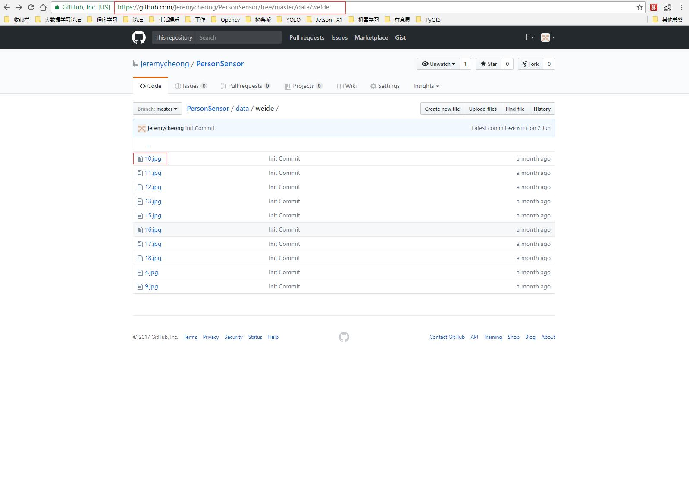

## 换行
直接回车不能换行，  
可以在上一行文本后面补两个空格，  
这样下一行的文本就换行了。

或者就是在两行文本直接加一个空行。

也能实现换行效果，不过这个行间距有点大。  	

---
## 文本
普通文本与单行文本不过多介绍，下面看一下文本块。
###文本块
文本块语法1：每行都缩进一个Tab 或四个空格。	

	欢迎查看
	Jeremy
	编写的Github Markdwon 语法 diff。	
	
文本块语法2：将文本快用三个反引号包裹。
```
欢迎查看
Jeremy
编写的Github Markdwon 语法 diff。
```
**注意：使用每行缩进的方式时，必须与之前的文字进行换行（之前文字结尾必须有一个Tab + 空行，文本块结束后结尾也应如此。）;使用反引号就不需要这些。**
###文字高亮
文字高亮使行内部分文字高亮，使用一对反引号。
语法：
```
`Linux` `Python` `socket`
```
效果如下：
`Linux` `Python` `socket`	

---
## 图片
基本格式：
```

```
alt和title即对应HTML中的alt和title属性（都可省略）：	

- alt 表示图片显示失败时的替换文本
- title 表示鼠标悬停在图片时的显示文本（注意这里要加引号）
- URL 表示图片的URL地址	

**注意：**	
 
* 如果引用本仓库的图片，直接写**相对路径**就可以了；
* 如果引用其他github仓库中的图片，格式为：`仓库地址/raw/分支名/图片路径`
* 如果引用为网络图片，一般建议写成标注格式，将URL地址统一写到文末。	

要将github其他仓库引用与互联网引用区分：	

例如，github仓库的图片的网络地址（浏览器中显示的地址）
```
https://github.com/jeremycheong/PersonSensor/tree/master/data/weide
```
截图展示：
	
如果直接使用写成：
```

```
结果是不会成功展示图片的。	

	

应当写成：
```

```
结果为：	

	

## 链接
链接到本地仓库，同样的URL使用的是**相对位置**。	

|语法|效果|
|---|---|
|`[README.md](README.md)`|[README.md](README.md)|
|`[test.md](data/test.md)`|[test.md](data/test.md)|	

### 图片链接
通俗讲，就是在显示图片的基础上使图片具有链接跳转功能。	

语法如下：
```
[![img/doubanFM.jpg]](https://douban.fm/)
```
效果如下：	

[](https://douban.fm/)	

就相当于将传统的链接`[alt](url "title")` 中的alt部分换成图片链接 ``，最终的形式为`[](url "title")`。	

## 列表
### 多级无序列表
格式如下：
```
* 编程语言
	* 脚本语言
		* Python
```
效果为：	

* 编程语言
	* 脚本语言
		* Python
### 多级有序列表
格式如下：	
```
1. 这是一级的有序列表，数字1还是1
   1. 这是二级的有序列表，阿拉伯数字在显示的时候变成了罗马数字
      1. 这是三级的有序列表，数字在显示的时候变成了英文字母
	     1. 四级的有序列表显示效果，就不再变化了，依旧是英文字母
```
效果如下所示：	

1. 这是一级的有序列表，数字1还是1
   1. 这是二级的有序列表，阿拉伯数字在显示的时候变成了罗马数字
      1. 这是三级的有序列表，数字在显示的时候变成了英文字母
	     1. 四级的有序列表显示效果，就不再变化了，依旧是英文字母	

### 复选框列表
格式如下：
```
- [x] 需求分析
- [x] 系统设计
- [x] 详细设计
- [ ] 编码
- [ ] 测试
- [ ] 交付
```
显示效果如下：	

- [x] 需求分析
- [x] 系统设计
- [x] 详细设计
- [ ] 编码
- [ ] 测试
- [ ] 交付	

## 代码高亮
在三个反引号后面加上编程语言的名字，另起一行开始写代码，最后一行再加上三个反引号。
格式如下：	

	```语言
	代码
	```	

效果如下：
```Java
public static void main(String[]args){} //Java
```
---
```c
int main(int argc, char *argv[]) //C
```
---
```Bash
echo "hello GitHub" #Bash
```
---
```cpp
string &operator+(const string& A,const string& B) //cpp
```
## 表格	
### 对齐方式
格式如下：
```
| 左对齐 | 居中  | 右对齐 |
| :------------ |:---------------:| -----:|
| col 3 is      | some wordy text | $1600 |
| col 2 is      | centered        |   $12 |
| zebra stripes | are neat        |    $1 |
```
效果如下所示：	

| 左对齐 | 居中  | 右对齐 |
| :------------ |:---------------:| -----:|
| col 3 is      | some wordy text | $1600 |
| col 2 is      | centered        |   $12 |
| zebra stripes | are neat        |    $1 |	

**表格中是可以嵌入其他的语法，比如使用文本的加粗，斜体，删除线等，也可以嵌入链接和图片等。**	

## diff语法
其语法与代码高亮类似，只是在三个反引号后面写diff，并且其内容中，以 `+ `开头表示新增，`- `开头表示删除。
语法如下：	

	```diff
	+ 鸟宿池边树，僧敲月下门
	- 鸟宿池边树，僧推月下门
	```
效果如下：	

```diff
+ 鸟宿池边树，僧敲月下门
- 鸟宿池边树，僧推月下门
```


